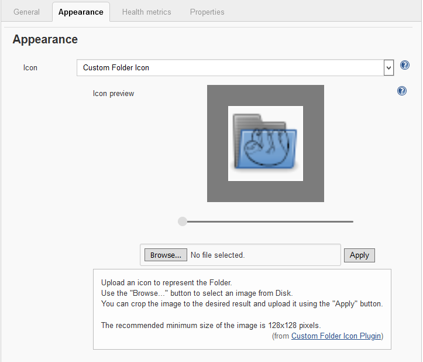
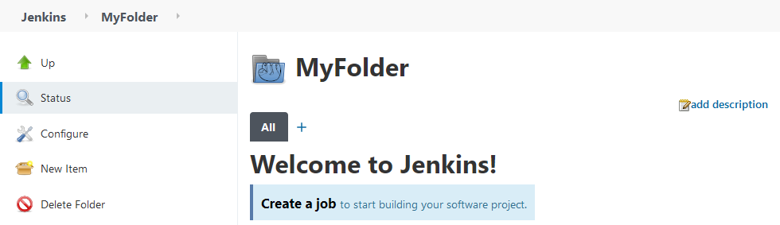

[[custom-folder-icon-plugin]]
= image:src/main/webapp/icons/default.png[] Custom Folder Icon Plugin image:src/main/webapp/icons/default.png[]
:toc: macro
:toc-title:

image:https://ci.jenkins.io/job/Plugins/job/custom-folder-icon-plugin/job/master/badge/icon[link="https://ci.jenkins.io/job/Plugins/job/custom-folder-icon-plugin/job/master/"]
image:https://github.com/jenkinsci/custom-folder-icon-plugin/workflows/CodeQL/badge.svg[link="https://github.com/jenkinsci/custom-folder-icon-plugin"]
image:https://img.shields.io/github/contributors/jenkinsci/custom-folder-icon-plugin.svg?color=blue[link="https://github.com/jenkinsci/custom-folder-icon-plugin/graphs/contributors"]
image:https://img.shields.io/jenkins/plugin/i/custom-folder-icon.svg?color=blue&label=installations[link="https://plugins.jenkins.io/custom-folder-icon"]
image:https://img.shields.io/github/release/jenkinsci/custom-folder-icon-plugin.svg?label=changelog[link="https://github.com/jenkinsci/custom-folder-icon-plugin/releases/latest"]

[#introduction]
== Introduction

This plugin extends the link:https://github.com/jenkinsci/cloudbees-folder-plugin[Folders plugin] to enable a custom icon for each folder.

toc::[]

[#changelog]
== Changelog

Since https://github.com/jenkinsci/branch-api-plugin/releases/tag/2.1044.v2c007e51b_87f[2.1044] of the https://github.com/jenkinsci/branch-api-plugin[branch-api-plugin] the Custom Folder Icons can be used for Multi-Branch or Organization Projects.

Release notes are recorded in https://github.com/jenkinsci/custom-folder-icon-plugin/releases[GitHub Releases] 

[#configuration]
== Configuration

[#folder-configuration]
=== Folder Configuration
Select the Custom Folder Icon option and use "Browse..." to chose a file. 

You can crop the image to the desired result and upload it using the "Apply" button. 

The file name will be randomized during upload.

Use your Custom Icon for each Folder.

[#global-configuration]
=== Global Configuration
Check for unused folder icon files and delete them.

image:images/global-configuration.png[]
