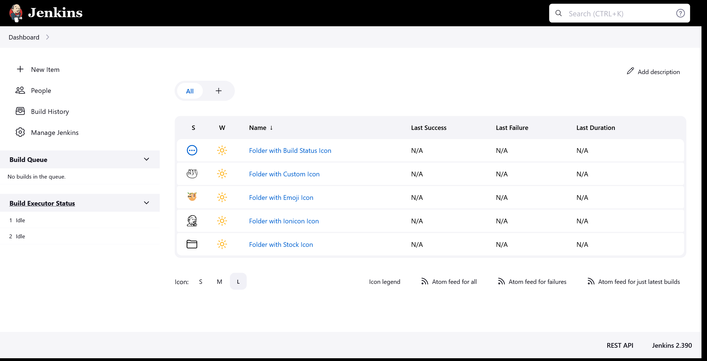
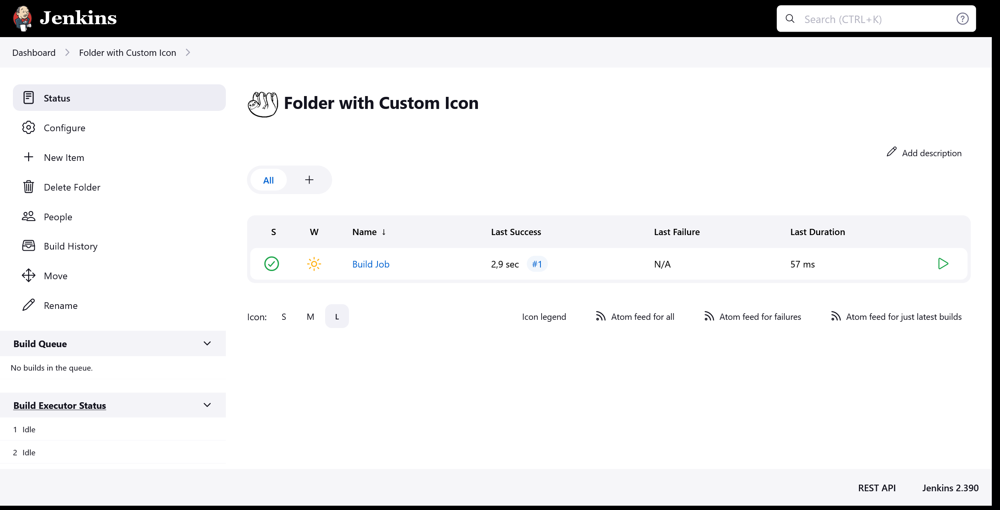
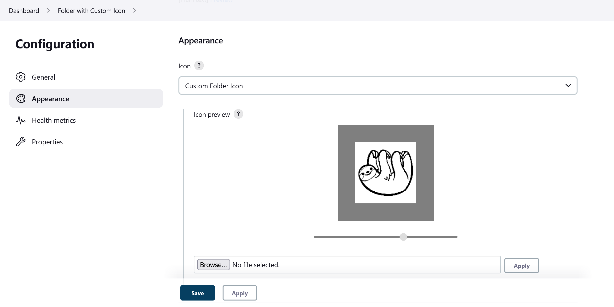
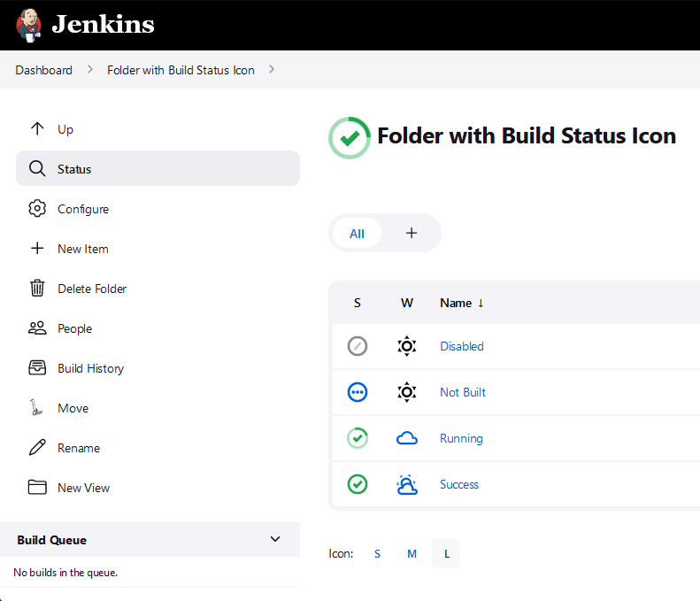
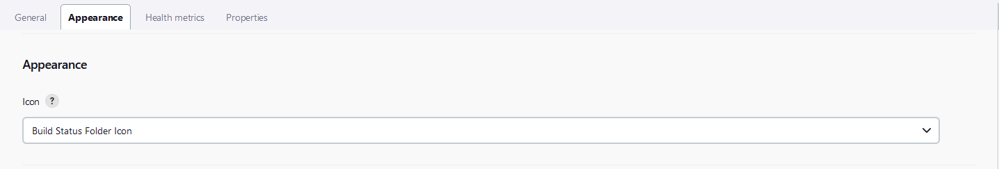
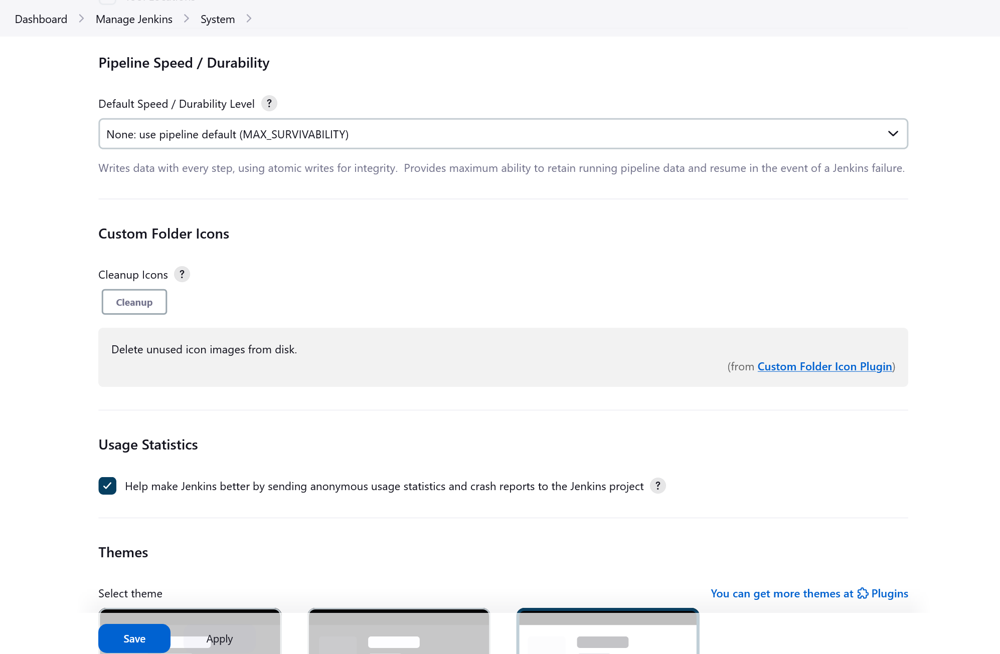

[[custom-folder-icon-plugin]]
=  Custom Folder Icon Plugin
:toc: macro
:toc-title:

image:https://ci.jenkins.io/job/Plugins/job/custom-folder-icon-plugin/job/master/badge/icon[link="https://ci.jenkins.io/job/Plugins/job/custom-folder-icon-plugin/job/master/"]
image:https://github.com/jenkinsci/custom-folder-icon-plugin/workflows/CodeQL/badge.svg[link="https://github.com/jenkinsci/custom-folder-icon-plugin"]
image:https://codecov.io/gh/jenkinsci/custom-folder-icon-plugin/branch/master/graph/badge.svg[link="https://codecov.io/gh/jenkinsci/custom-folder-icon-plugin"]
image:https://img.shields.io/github/contributors/jenkinsci/custom-folder-icon-plugin.svg?color=blue[link="https://github.com/jenkinsci/custom-folder-icon-plugin/graphs/contributors"]
image:https://img.shields.io/jenkins/plugin/i/custom-folder-icon.svg?color=blue&label=installations[link="https://plugins.jenkins.io/custom-folder-icon"]
image:https://img.shields.io/github/release/jenkinsci/custom-folder-icon-plugin.svg?label=changelog[link="https://github.com/jenkinsci/custom-folder-icon-plugin/releases/latest"]

[#introduction]
== Introduction
This plugin extends the link:https://github.com/jenkinsci/cloudbees-folder-plugin[Folders Plugin] to to provide custom icons for folders.
You can upload your own images or use the combined build status of the jobs within a folder as icon.

toc::[]

[#changelog]
== Changelog
Release notes are recorded in https://github.com/jenkinsci/custom-folder-icon-plugin/releases[GitHub Releases] 

=== Version 2.x
This version requires Jenkins 2.357 and above.

Version 2.x introduces a new type of icon. The `BuildStatusFolderIcon` displays the combined build status of the jobs within a folder.

=== Version 1.x
Since https://github.com/jenkinsci/branch-api-plugin/releases/tag/2.1044.v2c007e51b_87f[2.1044] of the https://github.com/jenkinsci/branch-api-plugin[branch-api-plugin] the Custom Folder Icons Plugin can be used for Multi-Branch or Organization Projects.

[#configuration]
== Configuration

[#folder-configuration]
=== Folder Configuration
There are two types of custom icons provided by this plugin. 

==== Custom Folder Icon
Use your custom icon for a folder.

Select the Custom Folder Icon option and use "Browse..." to chose a file. 

You can crop the image to the desired result and upload it using the "Apply" button. 

The file name will be randomized during upload.

==== Build Status Folder Icon
See the combined build status of the jobs within a folder.

Select the Build Status Folder Icon option to use the combined build status of the jobs within a folder as icon.

[#global-configuration]
=== Global Configuration
Check for unused custom folder icon files and delete them.
This operation will delete all images that are currently not used by any folder configuration. 

