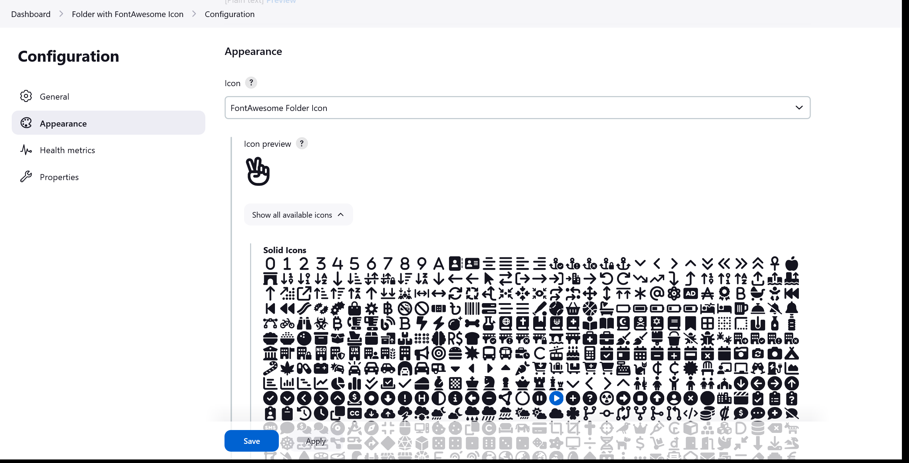
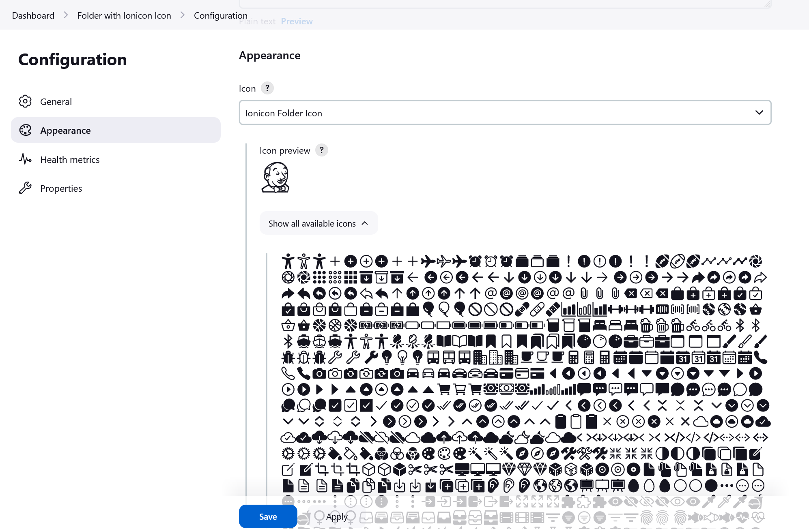
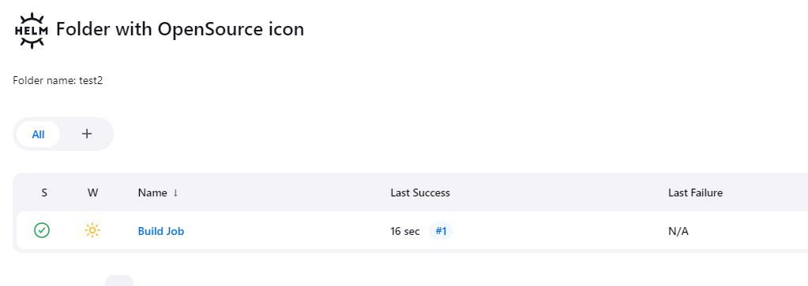
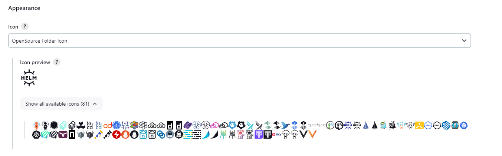

[[custom-folder-icon-plugin]]
= image:src/main/webapp/icons/default.png[48,48] Custom Folder Icon Plugin
:toc: macro
:toclevels: 3
:toc-title:

image:https://ci.jenkins.io/job/Plugins/job/custom-folder-icon-plugin/job/main/badge/icon[link="https://ci.jenkins.io/job/Plugins/job/custom-folder-icon-plugin/job/main/"]
image:https://codecov.io/gh/jenkinsci/custom-folder-icon-plugin/branch/main/graph/badge.svg[link="https://codecov.io/gh/jenkinsci/custom-folder-icon-plugin"]
image:https://github.com/jenkinsci/custom-folder-icon-plugin/actions/workflows/jenkins-security-scan.yml/badge.svg[link="https://github.com/jenkinsci/custom-folder-icon-plugin/actions/workflows/jenkins-security-scan.yml"]

image:https://img.shields.io/jenkins/plugin/i/custom-folder-icon.svg?color=blue&label=installations[link="https://stats.jenkins.io/pluginversions/custom-folder-icon.html"]
image:https://img.shields.io/github/contributors/jenkinsci/custom-folder-icon-plugin.svg?color=blue[link="https://github.com/jenkinsci/custom-folder-icon-plugin/graphs/contributors"]
image:https://img.shields.io/github/release/jenkinsci/custom-folder-icon-plugin.svg?label=changelog[link="https://github.com/jenkinsci/custom-folder-icon-plugin/releases/latest"]

== Introduction

This plugin extends the https://github.com/jenkinsci/cloudbees-folder-plugin[Folders Plugin] to provide custom icons for folders.
You can upload your own images, use predefined icons or use the combined build status of the jobs within a folder as icon.

toc::[]

== Changelog

Release notes are recorded in https://github.com/jenkinsci/custom-folder-icon-plugin/releases[GitHub Releases].

=== Version 2.x

This version requires Jenkins 2.357 and above in order to support the transition to https://www.jenkins.io/blog/2022/06/28/require-java-11/[Java 11].

* Version 2.11 moved the <<Global Configuration>> to the _Appearance_ configuration
* Version 2.10 enables users to select the jobs to be considered for the combined build status in `BuildStatusFolderIcon`.

.Changes in previous versions ...
[%collapsible]
====
* Version 2.9 introduces a new type of icon.
The `FontAwesomeFolderIcon` provides https://fontawesome.com[Font Awesome] icons.
* Version 2.6 enables users to select and re-use an already existing `CustomFolderIcon`.
Further an icon file will now be deleted automatically if the folder it used is being deleted - unless of course the file is still used by another folder.
* Version 2.5 introduces a new type of icon.
The `EmojiFolderIcon` provides https://unicode.org/emoji/charts/full-emoji-list.html[unicode emojis] as icon.
* Version 2.3 introduces a new type of icon.
The `IoniconFolderIcon` provides icons from https://github.com/jenkinsci/ionicons-api-plugin[ionicons-api-plugin].
* Version 2.0 introduces a new type of icon.
The `BuildStatusFolderIcon` displays the combined build status of the jobs within a folder.
* Since https://github.com/jenkinsci/job-dsl-plugin/releases/tag/job-dsl-1.83[1.83] of the https://github.com/jenkinsci/job-dsl-plugin[job-dsl-plugin] the Custom Folder Icons Plugin can be used in Job DSL configurations.
====

=== Version 1.x

Legacy version for Jenkins versions before 2.357.

* Since https://github.com/jenkinsci/branch-api-plugin/releases/tag/2.1044.v2c007e51b_87f[2.1044] of the https://github.com/jenkinsci/branch-api-plugin[branch-api-plugin] the Custom Folder Icons Plugin can be used for Multi-Branch or Organization Projects.

== Configuration

=== Folder Configuration

There are multiple types of custom icons provided by this plugin.

image:images/overview.png[]

==== Custom Folder Icon

Use your custom icon for a folder.

image:images/custom-folder-icon.png[]

Select the _Custom Folder Icon_ option and use `Browse...` to choose a file.

You can crop the image to the desired result and upload it using the `Apply` button.

The file name will be randomized during upload.

You can also select an image from the list of the already available icons.

The file will be deleted automatically if the folder it used is being deleted - unless of course the file is still used by another folder.

image:images/custom-folder-icon-configuration.png[]

===== Job DSL

Configuration via https://github.com/jenkinsci/job-dsl-plugin[job-dsl-plugin]:

[source,groovy]
----
userContent('customFolderIcons/custom.png', streamFileFromWorkspace('custom.png'))

folder('custom-icon') {
    icon {
        customFolderIcon {
            foldericon('custom.png')
        }
    }
}
----

==== Build Status Folder Icon

See the combined build status of the jobs within a folder.

image:images/build-status-folder-icon.png[]

Select the _Build Status Folder Icon_ option to use the combined build status of the jobs within a folder as icon.

You can select which jobs should be considered when the combined build status is determined.

When no jobs are selected every job within the folder is considered for the combined build status.

image:images/build-status-folder-icon-configuration.png[]

===== Job DSL

Configuration via https://github.com/jenkinsci/job-dsl-plugin[job-dsl-plugin]:

[source,groovy]
----
folder('build-status') {
    icon {
        buildStatusFolderIcon {
            jobs(['main', 'dev'] as Set)
        }
    }
}
----

==== Emoji Folder Icon

Use https://unicode.org/emoji/charts/full-emoji-list.html[unicode emojis] as icon.

image:images/emoji-folder-icon.png[]

Select the _Emoji Folder Icon_ option and select any of the available emojis.

image:images/emoji-folder-icon-configuration.png[]

===== Job DSL

Configuration via https://github.com/jenkinsci/job-dsl-plugin[job-dsl-plugin]:

[source,groovy]
----
folder('emoji-icon') {
    icon {
        emojiFolderIcon {
            emoji('sloth')
        }
    }
}
----

==== FontAwesome Folder Icon

Use https://fontawesome.com[Font Awesome Icons] provided by https://github.com/jenkinsci/font-awesome-api-plugin[font-awesome-api-plugin] as icon.

Select the _FontAwesome Folder Icon_ option and select any of the available icons.

===== Job DSL

Configuration via https://github.com/jenkinsci/job-dsl-plugin[job-dsl-plugin]:

[source,groovy]
----
folder('fontawesome-icon') {
    icon {
        fontAwesomeFolderIcon {
            fontAwesome('brands/jenkins')
        }
    }
}
----

==== Ionicon Folder Icon

Use https://ionic.io/ionicons[Ionicons] provided by https://github.com/jenkinsci/ionicons-api-plugin[ionicons-api-plugin] as icon.

image:images/ionicon-folder-icon.png[]

Select the _Ionicon Folder Icon_ option and select any of the available icons.

===== Job DSL

Configuration via https://github.com/jenkinsci/job-dsl-plugin[job-dsl-plugin]:

[source,groovy]
----
folder('ionicon-icon') {
    icon {
        ioniconFolderIcon {
            ionicon('jenkins')
        }
    }
}
----

==== OpenSource Folder Icon

Use icons provided by https://github.com/jenkinsci/oss-symbols-api-plugin[oss-symbols-api-plugin] as icon.

Select the _OpenSource Folder Icon_ option and select any of the available icons.

===== Job DSL

Configuration via https://github.com/jenkinsci/job-dsl-plugin[job-dsl-plugin]:

[source,groovy]
----
folder('opensource-icon') {
    icon {
        openSourceFolderIcon {
            ossicon('cdf-icon-color')
        }
    }
}
----

=== Global Configuration

Check for unused custom folder icon files and delete them.
This operation will delete all images that are currently not used by any folder configuration.

image:images/global-configuration.png[]
