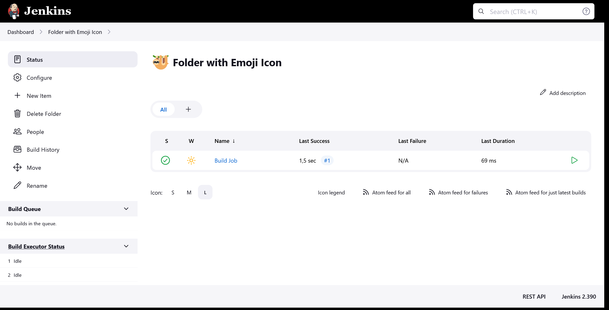
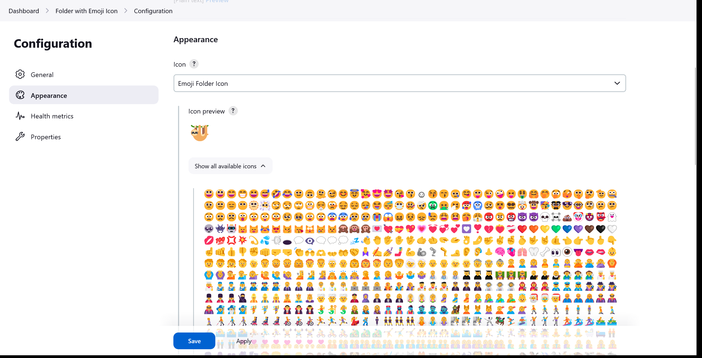
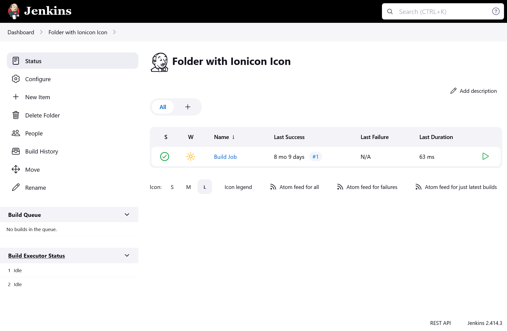

[[custom-folder-icon-plugin]]
= image:src/main/webapp/icons/default.png[48,48] Custom Folder Icon Plugin
:toc: macro
:toclevels: 3
:toc-title:

image:https://ci.jenkins.io/job/Plugins/job/custom-folder-icon-plugin/job/master/badge/icon[link="https://ci.jenkins.io/job/Plugins/job/custom-folder-icon-plugin/job/master/"]
image:https://codecov.io/gh/jenkinsci/custom-folder-icon-plugin/branch/master/graph/badge.svg[link="https://codecov.io/gh/jenkinsci/custom-folder-icon-plugin"]
image:https://github.com/jenkinsci/custom-folder-icon-plugin/actions/workflows/jenkins-security-scan.yml/badge.svg[link="https://github.com/jenkinsci/custom-folder-icon-plugin/actions/workflows/jenkins-security-scan.yml"]

image:https://img.shields.io/jenkins/plugin/i/custom-folder-icon.svg?color=blue&label=installations[link="https://stats.jenkins.io/pluginversions/custom-folder-icon.html"]
image:https://img.shields.io/github/contributors/jenkinsci/custom-folder-icon-plugin.svg?color=blue[link="https://github.com/jenkinsci/custom-folder-icon-plugin/graphs/contributors"]
image:https://img.shields.io/github/release/jenkinsci/custom-folder-icon-plugin.svg?label=changelog[link="https://github.com/jenkinsci/custom-folder-icon-plugin/releases/latest"]

== Introduction
This plugin extends the https://github.com/jenkinsci/cloudbees-folder-plugin[Folders Plugin] to provide custom icons for folders.
You can upload your own images, use predefined icons or use the combined build status of the jobs within a folder as icon.

toc::[]

== Changelog
Release notes are recorded in https://github.com/jenkinsci/custom-folder-icon-plugin/releases[GitHub Releases].

=== Version 2.x
This version requires Jenkins 2.357 and above in order to support the transition to https://www.jenkins.io/blog/2022/06/28/require-java-11/[Java 11].

* Version 2.5 introduces a new type of icon. The `EmojiFolderIcon` provides https://unicode.org/emoji/charts/full-emoji-list.html[unicode emojis] as icon.
* Version 2.3 introduces a new type of icon. The `IoniconFolderIcon` provides icons from https://github.com/jenkinsci/ionicons-api-plugin[ionicons-api-plugin].
* Version 2.0 introduces a new type of icon. The `BuildStatusFolderIcon` displays the combined build status of the jobs within a folder.
* Once https://github.com/jenkinsci/job-dsl-plugin/pull/1258[#1258] of the https://github.com/jenkinsci/job-dsl-plugin[job-dsl-plugin] is merged the Custom Folder Icons Plugin can be used in Job DSL configurations.

=== Version 1.x
Legacy version for Jenkins versions before 2.357.

* Since https://github.com/jenkinsci/branch-api-plugin/releases/tag/2.1044.v2c007e51b_87f[2.1044] of the https://github.com/jenkinsci/branch-api-plugin[branch-api-plugin] the Custom Folder Icons Plugin can be used for Multi-Branch or Organization Projects.

== Configuration
=== Folder Configuration
There are multiple types of custom icons provided by this plugin. 

image:images/overview.png[]

==== Custom Folder Icon
Use your custom icon for a folder.

image:images/custom-folder-icon.png[]

Select the Custom Folder Icon option and use "Browse..." to chose a file. 

You can crop the image to the desired result and upload it using the "Apply" button.

The file name will be randomized during upload.

image:images/custom-folder-icon-configuration.png[]

===== Job DSL
Configuration via https://github.com/jenkinsci/job-dsl-plugin[job-dsl-plugin]:

[source]
----

userContent('customFolderIcons/custom.png', streamFileFromWorkspace('custom.png'))

folder('custom') {
  icon {
    customFolderIcon {
      foldericon('custom.png')
    }
  }
}

----

==== Build Status Folder Icon
See the combined build status of the jobs within a folder.

image:images/build-status-folder-icon.png[]

Select the Build Status Folder Icon option to use the combined build status of the jobs within a folder as icon.

image:images/build-status-folder-icon-configuration.png[]

===== Job DSL
Configuration via https://github.com/jenkinsci/job-dsl-plugin[job-dsl-plugin]:

[source]
----
folder('build-status') {
  icon {
      buildStatusFolderIcon()
  }
}
----

==== Emoji Folder Icon
Use https://unicode.org/emoji/charts/full-emoji-list.html[unicode emojis] as icon.

Select the Emjoi Folder Icon option and select any of the available emojis.

===== Job DSL
Configuration via https://github.com/jenkinsci/job-dsl-plugin[job-dsl-plugin]:

[source]
----
folder('emoji') {
  icon {
    emojiFolderIcon {
      emoji('sloth')
    }
  }
}
----

==== Ionicon Folder Icon
Use https://ionic.io/ionicons[Ionicons] provided by https://github.com/jenkinsci/ionicons-api-plugin[ionicons-api-plugin] as icon.

Select the Ionicon Folder Icon option and select any of the available icons.

===== Job DSL
Configuration via https://github.com/jenkinsci/job-dsl-plugin[job-dsl-plugin]:

[source]
----
folder('ionicon') {
  icon {
    ioniconFolderIcon {
      ionicon('jenkins')
    }
  }
}
----

=== Global Configuration
Check for unused custom folder icon files and delete them.
This operation will delete all images that are currently not used by any folder configuration. 

image:images/global-configuration.png[]
